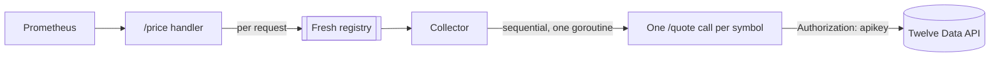

# Architecture

This document preserves the foundational design and architectural principles of the twelvedata-exporter.

## Scrape Path

Each scrape reads Twelve Data live, and no cache or collector state survives a request. The handler builds a [fresh registry and collector per request](../internal/server.go#L77), and the [symbol loop](../internal/collector.go#L89) runs sequentially in one goroutine. A slow upstream call therefore delays the whole scrape linearly.

The scrape URL alone names the symbols. The handler reads [every `symbols` parameter](../internal/server.go#L65) and [splits each on commas](../internal/server.go#L74), concatenating them in the order given. Nothing deduplicates the list, so a repeated symbol spends a second credit and still publishes one series.

| Bound                | Value | Covers             |
| :------------------- | :---- | :----------------- |
| Client timeout       | 10s   | One `/quote` call  |
| Server write timeout | 60s   | The whole response |

The [client timeout](../internal/twelvedata.go#L92) bounds one call and the [write timeout](../internal/server.go#L55) bounds the response, with no cap on the scrape between them. Seven stalled symbols therefore exceed the write deadline and cut the response short. No reply carries a rate-limit or `Retry-After` header, so the scrape interval is the only pacing mechanism.

## Endpoints

Both paths answer on the address `--web.listen-address` and `--web.listen-port` bind, and neither authenticates. [`SECURITY.md`](../SECURITY.md) specifies the network exposure they assume.

| Path     | Methods | Status | Behavior                            |
| :------- | :------ | :----- | :---------------------------------- |
| `/price` | Any     | 200    | Scrapes the symbols the query names |
| `/`      | Any     | 200    | Catch-all landing page, never 404   |

Every unmatched path falls through to [the landing page](../internal/server.go#L46), which answers HTTP 200 with HTML rather than 404. Neither handler restricts the method, so `POST` scrapes exactly as `GET` does. A probe asserting on status alone cannot tell a mistyped path from a healthy one.

Naming no symbol [returns before any upstream call](../internal/server.go#L68), answering HTTP 200 with an empty body and counting as a successful scrape.

## Absence

A symbol that fails withholds its five series while the scrape still answers 200. The [collector skips a failed symbol and continues](../internal/collector.go#L91), so one failure is scoped to one symbol.

An upstream error decodes into the quote struct without failing, leaving every quote field empty. The client [rejects the reply on the missing name](../internal/twelvedata.go#L148), so a `401` for a revoked key and a `404` for an unknown symbol are indistinguishable.

A field that decodes but fails to parse publishes `0`, because [`parseFloatOrZero`](../internal/collector.go#L121) returns zero on error. No label separates that from a genuine zero. [`twelvedata_price`](../internal/collector.go#L112) is computed as `previous_close + change`, so an unparsed previous close collapses it onto the change.

## Counter Semantics

[`twelvedata_queries_total`](../internal/collector.go#L87) rises once where a scrape enters the collector rather than once per symbol. The request rate the account is billed for is this rate multiplied by the symbol count.

[`twelvedata_query_duration_seconds`](../internal/twelvedata.go#L153) observes after the response parses, so a request that failed or returned a nameless quote reaches neither `_count` nor `_sum`. The registry gathers the summary and the collector concurrently, so `_count` reports the scrape before.

## Technical Notes

The [process and Go collectors](../internal/server.go#L36) sit on a registry no handler serves, so no `go_` or `process_` series appear. The [per-request registry](../internal/server.go#L80) carries the collector and the three package-level self metrics alone.

The credential travels in an [`Authorization` header](../internal/twelvedata.go#L118), and [no redirect is followed](../internal/twelvedata.go#L102). Alert on `absent(twelvedata_price)` rather than `up`, which stays `1` through every upstream failure.
